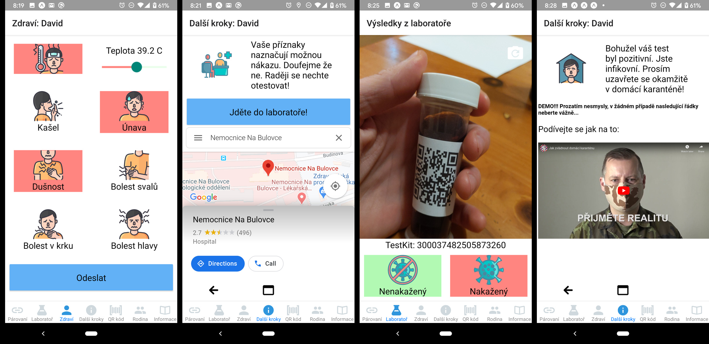

# covid19app — aplikace pro boj s koronavirem

Pandemie covid-19 je naší každodenní realitou. Je na nás jak dlouho to bude trvat a kolik životů a finančních prostředků nás to bude stát. Karanténou sice srazíme počáteční špičku, ale kdo v karanténě vydrží do doby než bude vyvinuta vakcína (rok a půl?)? Nejlepší strategií je zřejmě rychlá izolace nakažených a jejich léčba odděleně od zbytku populace. Takovou strategií se dá počet infikovaných držet v rozumné míře a při troše štěstí i virus vymýtit úplně. Testovat, testovat, testovat a izolovat.

Jak si můžeme pomoci? Co kdyby jsme vyrobily mobilní aplikaci? Dedikovanou mobilní aplikaci jen pro covid-19. Bude dělat jen jednu věc, ale bude jí dělat pořádně!

Funguje to už dnes. Zkuste to na [zde](demo)!

## Každý může pomoci!

Co kdyby jsme každý mohli zadat své příznaky (horečka, kašel, atd.)? Aplikace k nim automaticky přidá čas a lokaci. Z dat bude vidět kde se nám nemoc rozmáhá. Už ze symptomů lze odhadnout pravděpodobnost nákazy. Vaše příznaky a historie kontaktu s nakaženými je konec konců asi to jak vám dnes doktor doporučí zda se nechat testovat. Nemá ale dnes doktor dost jiné práce? Jak má vlastně vědět jaká je šance že jste s virem přišli do styku? Jak má vědět koho jste potkali a zda byli nakažení? Má alespoň aktuální statistiku kolik lidí ve vašem městě je nakažených? Co kdyby jsme udělali aplikaci která vezme symptomy a vyhodnotí co dělat dál?

## Doporučení co dál

Aplikace zobrazí co a jak dál. Tohle je jedna z věcí kterou můžeme řídit centrálně pro celou zemi, nebo delegovat na úroveň okresů či měst. Podle toho kde se pacient nachází, a dalšího kontextu můžeme zobrazit vhodný obsah a pružně jej změnit i několikrát denně.

Dokonce i koncept laboratoře se může měnit. Mobilní odběrové místo může být každý den jinde. Tam kde je jí potřeba. Aplikace je k takovým věcem skvělá příležitost. Sbírá data o tom kde jsou lidé potřebují odběr. Na základě toho se můžete rozhodnout kde zítra testovat. A push notifikací poslat lidem link do map ať je to zítra dovede na správné místo. Obdobně lze pomoci odběrové sanitce.

 

## Laboratoř

V laboratoři odeberou vzorek a vykonají administrativu. Vzorek si brzy možná budeme odebírat doma sami. Snad. Ale i tak asi budou nějaké laboratoře. Se samotným odběrem vzorku software moc nepomůže. S administrací ale ano. Tak tedy co je potřeba? Spárovat identitu pacienta se vzorkem? Co kdyby jsme jen zobrazily QR kód v aplikaci? Laborant by ji naskenoval ve vteřině a bezdotykově na svém mobilu. K tomu by naskenoval kód na testkitu a to je vše.

Samozřejmě by to fungovalo i pro pacienty bez aplikace - ti by nadiktovali telefon, email nebo snad i poštovní adresu. Bylo by ale pro všechny lepší kdyby jsme (téměř) u nikoho nemuseli čekat, než k potencionálně infekčnímu pacientovi přiběhne pošťák s papírkem. Jak se vlastně dostane informace o testu k pacientovi? Co kdyby v laboratoři naskenovali kód z testu a zadali zda je výsledek pozitivní či nikoliv. Pacient dostane notifikaci ve vteřině na mobil. Může si o to dříve uvědomit, že pořádná karanténa je okamžitě nezbytná. Nebo se naopak nemusí stresovat ani o vteřinu déle než je nutné.

 

## Dohledávání kontaktů

Dohledávání nakažených a jejich důsledná izolace je snad to nejlepší co můžeme dělat!

Můžeme pravidelně sbírat data o lokaci, wifi, bluetooth a podle toho určit kdy jsme byli v kontaktu a s kým. Mohli by jsme umožnit i explicitní párování. Trávíte hodně času s někým nablízku? Můžete ve vteřině naskenovat jeho qr kód. To je ale moc práce a asi by se to neujalo ve velkém. Implicitní trackování zejména bluetooth je to nejlepší co můžeme dělat.

Když máme data o kontaktech a testech v jednom systému tak můžeme do minuty od zadání výsledku v laboratoři posílat notifikace. Třeba něco jako: 'Minulou neděli 29.3. mezi 16:00 a 17:00 v těsné blízkosti tří pacientů jež byli dnes diagnostikováni s virem. Byli jste opravdu blízko? Ihned se prosím izolujte ať nikoho nenakazíte. Jeden z našich kolegů vám do hodiny bude volat. Děkujeme za spolupráci!'. Mohli by jsme drasticky zkrátit čas do izolace nakažených. A to je alfa a omega pokud nechceme umírat jako ve středověku, být rok ve domácí karanténě a ještě to po generace to splácet.

Dohledávání lidí v kontaktu s nakaženými a jejich izolace je to nejlepší co můžeme dělat dokud nebude vakcína. Pokud potáhneme za jeden provaz a budeme efektivní v dohledávání, testování a izolaci tak virus eliminujeme dlouho před vakcínou.

 

## Přínos

Pro každého občana:

1. Chránit **zdraví každého z nás**. Vyhrát jako národ a celé lidstvo.
2. Zadat příznaky rychleji než najdete telefon na doktora.
2. **Okamžitá odpověď** co a jak dělat - být v klidu, jít do laboratoře, volat doktora, jet do nemocnice.
3. **Lepší odpověď** - aplikace ví kolik je ve vaší oblasti nakažených (a mnohem víc) - může tedy lépe odhadnout pravděpodobnost nákazy koronavirem
4. Lepší doporučení kdy a kde se nechat otestovat (aplikace ví kde jsou laboratoře i kolik lidí tam dnes poslala)
5. **Výsledek testu** doručit notifikací do telefonu **okamžitě** po zadání v laboratoři

Přínos pro nemocnice, doktory a laboratoře:

1. **Úspora času** a administrativy! Nevolat a nechodit k doktorovi. Ještě by jste ho nakazili. Stejně vás pošle do laboratoře na základě teploty nebo tak něco. To software zvládne snadno! Ale léčit neumí. Na to by měli mít doktoři čas.
2. **Lepší rozhodnutí**. Systém by věděl jak dlouhá je fronta v té či oné laboratoři, nemocnici, ... může tedy pomoci směrovat tok pacientů.
3. Dohlédnout na lidi v domácí karanténě. Nebylo by dobré kdyby dvakrát denně zadali příznaky? Mohli by jsme automaticky doporučit kdy už jít do nemocnice nebo kdy se jít testovat jestli už se vyléčili (v tom lepším případě).
4. Rozhodovat koho testovat a koho ne pokud je realita taková že laboratoře nestíhají. Taková rozhodnutí jsou těžká, někdy však nezbytná.
5. Jak můžeme doktorům a sestrám pomoci?

## Analytika

Analytika je naprosto klíčová. Vláda, hygiena i veřejnost musí mít co nejvíce informací co nejdříve. Tahle pandemie má zásadní vliv na náš život dnes i pro budoucnost. Bylo by rozumné se rozhodovat na základě dat. Z dat na serveru je jednoduché vyrobit analytiku o tom kde a kolik máme lidí s příznaky, otestovaných, nakažených, v karanténě, vyléčených, ...

Aplikace také otevírá komunikační kanál. Cílený podle oblasti, zdravotního stavu, věku, atd. Můžeme třeba zobrazit lidem, že jsou v oblasti s maximální karanténou. Co to znamená, kde všude to platí, atd.

## Soukromí

Data získaná v aplikaci by byly použity jen pro boj s covid-19. Nicméně pro to nejdůležitější - dohledávání kontaků - data potřebujeme. Nemusíme je ale ani všechny nahrávat na server. Pokud jste zdraví a nikde široko daleko nebyl nikdo nakažený pak ať váš telefon ani neopouští. Data co se nahrají na server mohou být smazána za pár týdnů protože v boji s nemocí jsou už k ničemu. Tedy snad kromě výzkumu. Navrhoval bych data rok či dva podržet pro výzkum - univerzity a hygienu. Bylo by dobré se poučit na generace dopředu. Potom smazat. Potom smazat. Žádné přeprodávání ani jiné finty. Nebudujeme policejní stát ani nesbíráme data pro reklamy. Proti viry ksme v tom společně, jsme lidi - spolu jsme napadení, spolu se bráníme!

## Inteligentní karanténa?

V Čechách se mluví o *inteligentní karanténě*. Pojďme to dát dohromady! Je to na githubu? Měli by jsme mít jednu aplikaci pro občany pro trackování (bluetooth, wifi, gps), symptomy, testy a zkrátka vše s tím spojené. Proto 

Nicméně k tomu co jsem slyšel o probíhajích projektech se musím zeptat co to je za nápady s kreditní kartou a operátory? K čemu je dobré vědět kolik a za co utácíte? A co s operátorem? Lidi se kterými jsem telefonoval se přes telefon nenakazím. Tringulace z vysílačů je také k ničemu. Bluetooth smysl dává! Máte to na githubu? Mohu pomoci? Pojďme to dát dohromady! Myslím, že příznaky a laborky se stejně hodí. Navíc při troše štěstí udělá bluetooth tracking Google a Apple kteří to mohou natlačit miliardám lidí. Ale není to na jistotu. Může to trvat. Navíc by to stejně neřešilo pomoc s testováním.

## Zkuste aplikaci ještě dnes!

[https://covid19app.org/czech/demo](https://covid19app.org/czech/demo)

Není to samozřejmě perfektní, ale funguje to. Symptomy, doporučení, notifikace výsledků a ještě víc si můžete zkusit ještě dnes. Můžeme to používat v ostrém provozu ještě tenhle týden. Co myslíte? Dává to smysl? Máte lepší nápad? Sem s ním!

## Přidejte se!

[https://github.com/covid19app](https://github.com/covid19app)

#### Credits

Graphics by [KP Arts](https://www.iconfinder.com/katsana24)